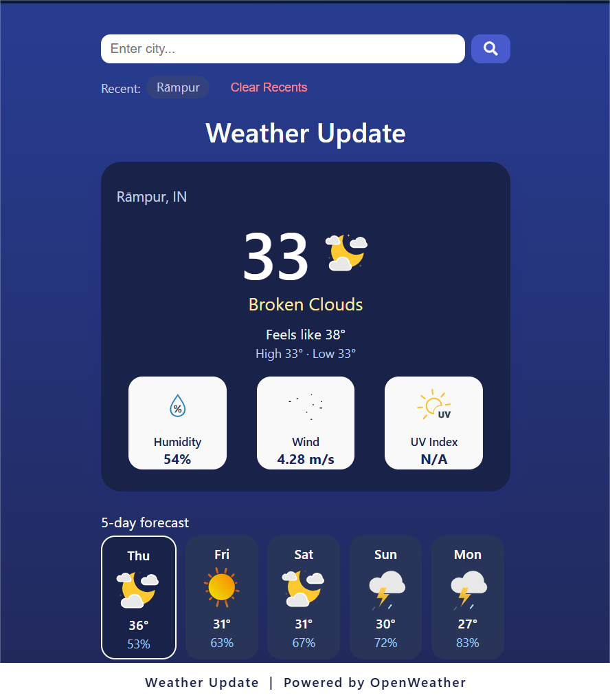

# SkyPulse: Weather Dashboard

---

## 🌐 Live Demo

[View SkyPulse Weather Dashboard](https://Mansi2202.github.io/weather-dashboard/)

---

## 📖 Description

**SkyPulse** is a modern, visually-rich weather dashboard that brings you real-time weather updates and a 5-day forecast for any city worldwide. Featuring animated Lottie icons, instant search, auto-location detection, and a clean, responsive design, SkyPulse offers a delightful weather experience on any device.

---

## ✨ Features

- 🌎 **Live Current Weather** for any city worldwide
- 📍 **Auto-Detects Your Location** on page load
- 📅 **5-Day Scrollable Forecast** with daily details
- 🎬 **Animated Weather Icons** (Lottie, local)
- 🏙️ **Recent Searches** chips for quick recall and clearing
- 🌡️ **UV Index Color Coding:** Favorable, moderate, severe
- 💻 **Modern, Responsive UI:** Clean and mobile-friendly
- 🚫 **No Page Reloads:** Data updates dynamically
- 🔒 **Your Data Stays Local:** No registration, no cloud storage

---

## 👤 User Story

- **AS A** traveler  
- **I WANT** to see the weather outlook for multiple cities  
- **SO THAT** I can plan a trip accordingly  

---

## ✅ Acceptance Criteria

- **GIVEN** a weather dashboard with form inputs  
- **WHEN** I search for a city  
  - **THEN** I am presented with current and future conditions for that city and that city is added to the search history  
- **WHEN** I view current weather conditions for that city  
  - **THEN** I am presented with the city name, the date, an icon representation of weather conditions, the temperature, the humidity, the wind speed, and the UV index  
- **WHEN** I view the UV index  
  - **THEN** I am presented with a color that indicates whether the conditions are favorable, moderate, or severe  
- **WHEN** I view future weather conditions for that city  
  - **THEN** I am presented with a 5-day forecast that displays the date, an icon representation of weather conditions, the temperature, and the humidity  
- **WHEN** I click on a city in the search history  
  - **THEN** I am again presented with current and future conditions for that city  

---

## 🖼️ Mock-Up



---

## 🚀 Usage

- Search for any city to get its current weather and a 5-day forecast.
- Displays city name, date, weather icon, temperature, humidity, wind speed, and UV index.
- UV index is color-coded (favorable, moderate, severe).
- Search history is saved and clickable, allowing quick revisit of previous searches.
- Fully mobile compatible and responsive.
- Animated icons via Lottie for a richer experience.

---

## 💻 Technologies Used

- [OpenWeatherMap API](https://openweathermap.org/) (live data)
- **HTML5, CSS3, JavaScript (ES6+, Vanilla)**
- **LocalStorage**
- **FontAwesome** (icon font)
- [LottieFiles](https://lottiefiles.com/) (local JSON animations)

---


## 📁 Repo Structure

```text
weather-dashboard/
├── assets/
│   ├── images/
│   │   └── Dashboard.png
│   ├── js/
│   │   └── script.js
│   └── lottie/
│       ├── humidity.json
│       ├── sunny.json
│       ├── uv index.json
│       ├── Weather-cloudy(night).json
│       ├── Weather-storm.json
│       ├── Weather-windy.json
│       └── Windblow.json
├── index.html
└── README.md

```
---

## 🛠️ How to Run Locally

1. **Clone the repository:**

    ```bash
    git clone https://github.com/Mansi2202/weather-dashboard.git
    cd weather-dashboard
    ```

2. **Get your API key:**

    - Register for a free API key at [OpenWeatherMap](https://openweathermap.org/api).
    - Open `assets/js/script.js` and replace with your actual API key:
      ```js
      const API_KEY = "YOUR_API_KEY_HERE";
      ```

3. **Run the app:**

    - Open `index.html` directly in your browser  
      **OR**  
    - Serve with a local HTTP server (recommended for API usage):

      ```bash
      python -m http.server
      ```
      Then open [http://localhost:8000](http://localhost:8000) in your browser.

    - Or use VS Code Live Server extension:
        - Install the **Live Server** extension
        - Right-click `index.html` and choose “Open with Live Server”.

---

## 🙋 Credits

- **Developed by:** [Mansi2202](https://github.com/Mansi2202)
- **Weather data by:** [OpenWeatherMap](https://openweathermap.org/)
- **Animated icons by:** [LottieFiles](https://lottiefiles.com/)

---

## © License

Copyright © 2024 Mansi2202  
All rights reserved.

---


